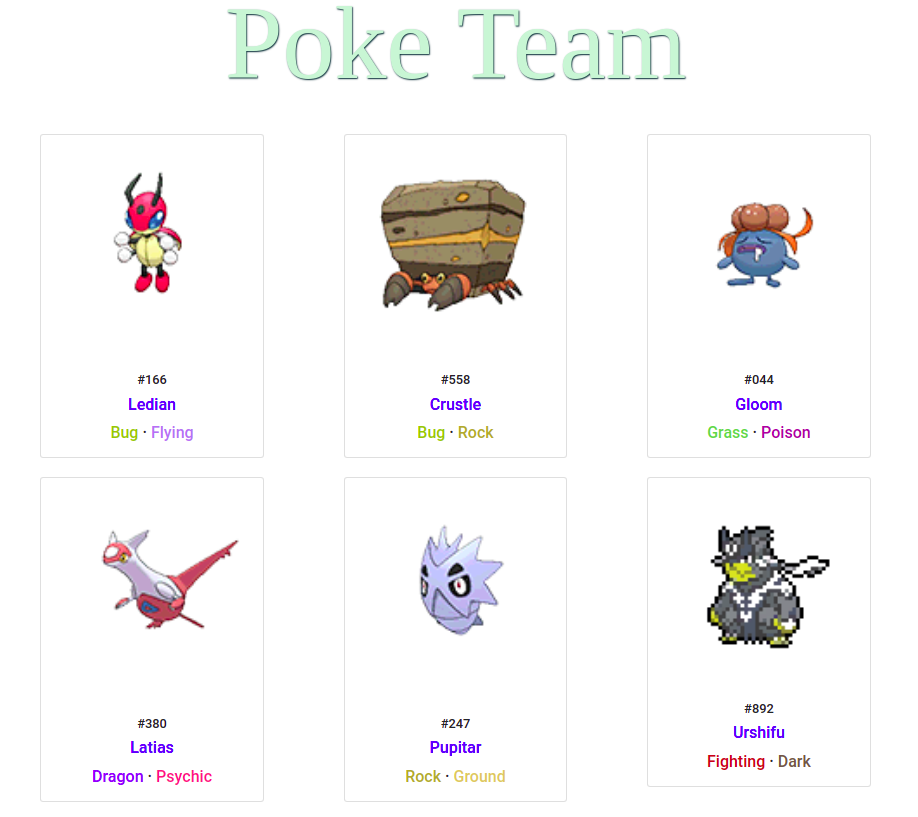

# Pokemon Web Scrapper

Challenge to build your pokémon team with members having two types and without repeating any pair of types among the rest. The data will be collected from the pokédex database (https://pokemondb.net/pokedex/national) and an html will be generated using a Bootstrap template.


## Built With
* [Python3](https://www.python.org/)
* [Bootstrap](https://getbootstrap.com)


## Getting Started

To get a local copy up and running follow these simple example steps.

### Prerequisites
* virtualenv
* python3

### Installation

1. Clone the repo
    ```sh
    git clone https://github.com/Rochii/pokemon-web-spider.git
    ```
2. Configure and activate virtual environment
    ```sh
    virtualenv -p python3 venv
    source venv/bin/activate
    ```
3. Install required pip libraries
    ```sh
    pip install -r requirements.txt
    ```

## Usage

1. Run:
    ```sh
    python pokescrapper.py
    ```
    <br />
    <p align="center">
        <a href="https://github.com/Rochii/pokemon-web-scrapper">
        
        </a>
    </p>